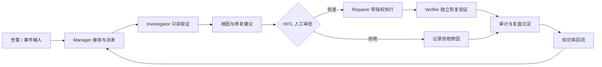
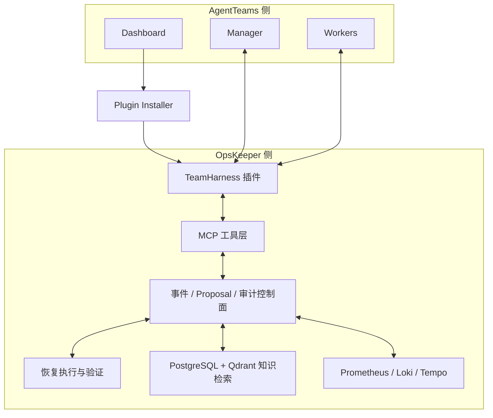

# OpsKeeper

[English](README.md) · 简体中文

OpsKeeper 是一个可审计的多 Agent 运维事件响应平台。它把告警接入、证据采集、根因分析、人工审批、窄授权恢复、独立验证和复盘沉淀放进同一条闭环，让 Agent 承担可验证的执行工作，同时让人保留高风险变更决策权。

> 核心原则：**默认只读诊断、变更必须审批、执行必须精确匹配、结果必须可审计、复盘必须沉淀。**

## 产品能力

| 能力 | 说明 |
|---|---|
| 多 Agent 协同 | Manager 负责任务分解与派发，Worker 按角色执行诊断、修复建议、验证与复盘。 |
| AgentTeams 插件接入 | 不修改 AgentTeams 内核，通过 Dashboard Installer 与 TeamHarness 插件接入 OpsKeeper MCP 工具链。 |
| 事件控制面 | 持久化 incident timeline、proposal 状态、恢复信号、审计事件与可重放指标。 |
| 安全执行边界 | 变更动作必须命中待批准 proposal，并绑定 incident、manifest、目标、命令与 payload hash。 |
| 运维知识检索 | PostgreSQL 关键词召回、Qdrant 向量召回、RRF 融合排序，并保留候选取舍证据。 |
| 可观测性 | OpenTelemetry trace context、Prometheus 指标、Loki 日志、Tempo trace 与 Grafana 看板。 |
| Web 控制台 | 提供事件、工作流、审批、审计、Trace 与运行状态页面。 |

## 响应闭环



闭环中的每一步都会记录来源、参数、身份、审批状态、执行结果与恢复信号。失败重派同样进入审计，不能被静默删除。

## 架构分层



AgentTeams 负责协同与交互，OpsKeeper 负责工具契约、权限、审计、执行治理与知识沉淀。两侧通过插件与 MCP 协议解耦，避免深绑定运行环境。

## Worker 角色

| 角色 | 中文名 | 职责 |
|---|---|---|
| alerter | 告警员 | 接收与归一化告警，生成待处理事件线索。 |
| investigator | 调查员 | 只读查询指标、日志、Trace、配置与事件上下文，定位可能根因。 |
| critic | 评审员 | 对诊断结论、证据充分性与风险进行质疑和补充。 |
| reviewer | 复核员 | 复核修复建议与影响面，确认与目标资源一致。 |
| repairer | 修复员 | 在 HITL 批准后执行窄授权修复动作。 |
| verifier | 验证员 | 独立验证业务恢复状态，避免修复者自证。 |
| postmortem reporter | 复盘员 | 汇总时间线、根因、动作与改进项，沉淀复盘知识。 |

产品能力覆盖七类角色。简化演示可以只让 Manager、investigator、repairer 三个角色参演，并由管理员完成 HITL 审批。

## 仓库结构

| 路径 | 内容 |
|---|---|
| `cmd/` | Go 服务与命令行工具 |
| `internal/` | 控制面、Manager、MCP、事件、审计与评估逻辑 |
| `web/` | React/Vite Web 控制台 |
| `plugins/agentteams-plugin-installer/` | AgentTeams Dashboard 安装插件 |
| `plugins/opskeeper-teamharness/` | Worker/Manager 集成插件与 MCP 代理 |
| `deploy/` | 部署资产、合成事件示例与运维手册 |
| `docs/` | 产品、集成、部署与运维文档 |
| `testdata/` | 确定性端到端测试数据 |

## 快速开始

### 环境要求

- Go 1.25+
- Node.js 20+、npm 10+、pnpm 9+
- Python 3.11+
- Docker 与 Docker Compose
- `zip`、`tar` 和常见 POSIX 工具

### 本地演示栈

仓库根目录的 `docker-compose.yml` 面向本地演示与集成验证，不适用于生产：

```bash
docker compose up -d --build
docker compose ps
curl -fsS http://localhost:8080/healthz
```

浏览器访问本地文档中对应的 Web 入口，并使用环境变量中的管理员账号登录。详细说明见 [`deploy/README.md`](deploy/README.md)。

生产部署应从 `deploy/install/` 或 `deploy/helm/` 出发，通过密钥管理系统注入凭据，配置 TLS，并逐项审查暴露端口与访问控制。

## 构建与验证

```bash
# Go 后端
go build ./...
go test ./... -count=1
make build

# Web 控制台
cd web
pnpm install --frozen-lockfile
pnpm typecheck
pnpm test
pnpm run build

# AgentTeams 插件
make build-plugins
make test-plugins
make verify-plugins

# TeamHarness 单独验证
bash plugins/opskeeper-teamharness/scripts/build-package.sh
python3 -m unittest discover -s plugins/opskeeper-teamharness -p 'test_*.py'

# 开源准入审计
python3 scripts/audit_open_source.py
```

插件产物位于各自插件的 `dist/` 目录，便于直接上传到 AgentTeams Dashboard 或 Plugin Manager。

## 合成事件示例

`deploy/incident-events/` 提供四类 PostgreSQL 场景：

- 连接池耗尽
- 锁等待
- 磁盘 I/O 饱和
- 副本回放延迟

所有数据均为合成数据，使用中性租户 `opskeeper-demo` 与确定性 ID，不包含客户标识、生产遥测、真实事件证据、凭据或私有端点。它们用于验证时间线、指标、审批状态与审计行为，不能替代真实生产数据集。

## 安全模型

1. 诊断默认只读，未知工具与越权能力默认拒绝。
2. 变更动作必须先创建 pending proposal，再由人显式批准。
3. 执行时必须精确匹配 incident、manifest、resource、command 与 payload hash。
4. repairer 与 verifier 职责分离，恢复结果由独立验证确认。
5. 审批、拒绝、执行、失败重派、恢复信号与复盘事件全部留痕。
6. shell/browser 逃逸、绕过审计、跨资源目标与未授权写操作失败关闭。

安全问题请按 [`SECURITY.md`](SECURITY.md) 中的方式私下报告，不要为未修复漏洞创建公开 issue。

## 文档

- [AgentTeams 插件安装指南](docs/guides/agentteams-plugin-installation.md)
- [集成指南](docs/integration-guide.md)
- [运维手册](docs/operations-manual.md)
- [部署说明](deploy/README.md)
- [公开路线图](ROADMAP_PUBLIC.md)
- [开源发布门禁](docs/OPEN_SOURCE_GATE.md)

## 发布范围

当前公开仓库包含 Go 后端、Web 控制台、AgentTeams 集成插件、部署资产、产品文档、合成数据与测试。私有交付证据、运行凭据、内部项目记录、生产拓扑与非公开事件数据均被排除。机器可读范围见 [`RELEASE_VERSION.json`](RELEASE_VERSION.json)。

## 致谢与许可证

感谢 GoAI AgentTeams 与 AgentTeams Dashboard 在多 Agent 协同、插件扩展和可观测交互上的启发。归因、非派生与非背书边界见 [`docs/ACKNOWLEDGMENTS.md`](docs/ACKNOWLEDGMENTS.md)。

OpsKeeper 按 Apache License 2.0 分发，详见 [`LICENSE`](LICENSE) 与 [`NOTICE.md`](NOTICE.md)。品牌资产不在 Apache-2.0 授权范围内，详见 [`TRADEMARK.md`](TRADEMARK.md)。
